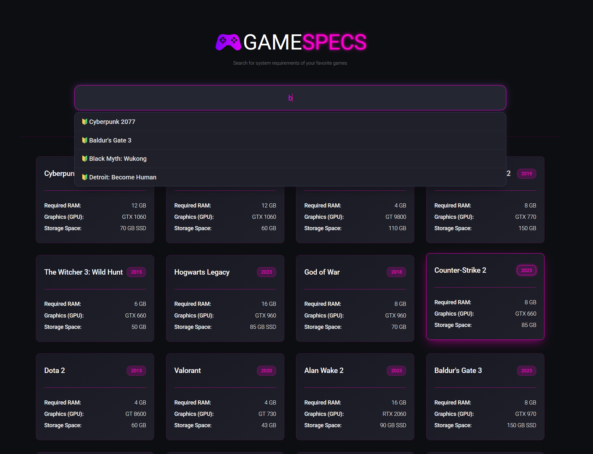

# 🎮 GAMESPECS | Game System Requirements Finder

A React web application designed for gamers to quickly check and find the minimum system requirements (RAM, GPU, Storage, and Release Year) for over 30 popular video games.

---

## 📸 Preview & Screenshots

---

## 🛠️

- **Frontend Library:** React.js
- **Styling:** Vanilla CSS3

---

## 🚀 Getting Started

Follow these steps to run the project locally on your machine:

1. Clone the Repository:
   git clone https://github.com/Mamadinit1/Game-Requierment-Finder.git

2. Navigate to the Project Directory:
   cd 'Game Requirement Finder'

3. Install Dependencies:
   npm install

4. Run the Development Server:
   npm start

---

## 📂 Project Structure

- public/
- src/
  - components/
    - SearchSuggest.jsx
  - Main/
    - Games.jsx
  - App.jsx
  - App.css
  - responsive.css
  - index.js
- README.md
- package.json
- preview.png

---

Made with 💜
